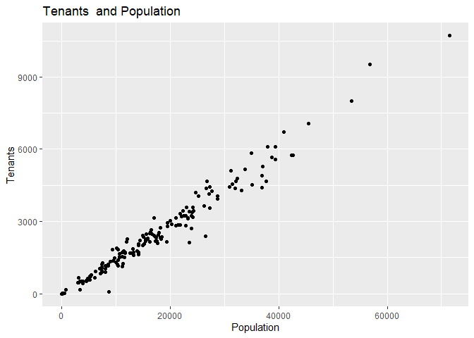
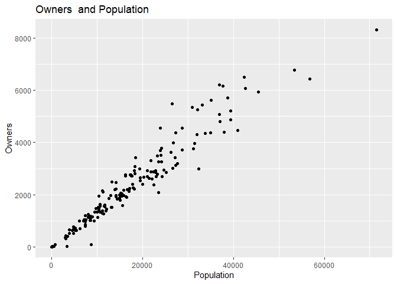

<!-- README.md is generated from README.Rmd. Please edit that file -->

# Populationpack2016

<!-- badges: start -->
<!-- badges: end -->

The goal of Populationpack2016 is to analyze information about
population based on number of families, owners, tenants and residential
units of all neighbourhoods in Mashhad, Iran. By clicking on
[here](https://niloofarnl.github.io/Populationpack2016/reference/population_density.html)
you can have access to the vignettes.

## Installation

You can install the development version of Populationpack2016 like so:

``` r
knitr::opts_chunk$set(message = FALSE)
if(!require(remotes)){
    install.packages("remotes")
    library(remotes)
}
remotes::install_github("NiloofarNL/Populationpack2016")
```

## Example

This is a basic example which shows you how to solve a common problem:

``` r
library(Populationpack2016)
library(knitr)
library(ggplot2)
```

``` r
summary(Population2016)
#>     OBJECTID   Neighbourhoods        Families         Owners    
#>  Min.   :  1   Length:173         Min.   :    0   Min.   :   0  
#>  1st Qu.: 44   Class :character   1st Qu.: 2552   1st Qu.:1120  
#>  Median : 87   Mode  :character   Median : 4620   Median :2096  
#>  Mean   : 87                      Mean   : 5259   Mean   :2342  
#>  3rd Qu.:130                      3rd Qu.: 7034   3rd Qu.:3020  
#>  Max.   :173                      Max.   :20359   Max.   :8314  
#>                                   NA's   :1       NA's   :1     
#>     Tenants      Total Residential Units Apartment Units  House Units   
#>  Min.   :    0   Min.   :    0           Min.   :    0   Min.   :    0  
#>  1st Qu.: 1162   1st Qu.: 2478           1st Qu.: 1002   1st Qu.:  758  
#>  Median : 2174   Median : 4540           Median : 2391   Median : 1428  
#>  Mean   : 2456   Mean   : 5122           Mean   : 3079   Mean   : 2043  
#>  3rd Qu.: 3258   3rd Qu.: 6812           3rd Qu.: 4583   3rd Qu.: 2595  
#>  Max.   :10708   Max.   :19815           Max.   :12164   Max.   :13236  
#>  NA's   :1       NA's   :1               NA's   :1       NA's   :1      
#>  Cottages or Sheds  Shape_Length     Shape_Area       Area(Hectare)   
#>  Min.   : 0.000    Min.   : 1899   Min.   :  190576   Min.   :  19.0  
#>  1st Qu.: 0.000    1st Qu.: 4290   1st Qu.:  876015   1st Qu.:  88.0  
#>  Median : 1.000    Median : 5364   Median : 1368233   Median : 137.0  
#>  Mean   : 1.773    Mean   : 5857   Mean   : 1762437   Mean   : 176.3  
#>  3rd Qu.: 2.000    3rd Qu.: 6925   3rd Qu.: 2067674   3rd Qu.: 207.0  
#>  Max.   :48.000    Max.   :20888   Max.   :16678412   Max.   :1668.0  
#>  NA's   :1                                                            
#>  PopulationDensity   Population   
#>  Min.   :  0.00    Min.   :    0  
#>  1st Qu.: 76.75    1st Qu.: 8415  
#>  Median :131.00    Median :15387  
#>  Mean   :131.25    Mean   :17141  
#>  3rd Qu.:175.00    3rd Qu.:23460  
#>  Max.   :367.00    Max.   :71466  
#>  NA's   :1
```

    #> Warning: Removed 1 rows containing missing values (geom_point).



    #> Warning: Removed 1 rows containing missing values (geom_point).


